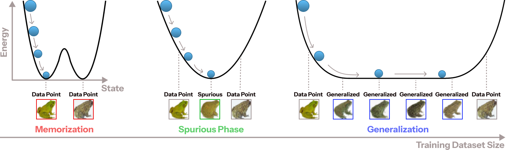
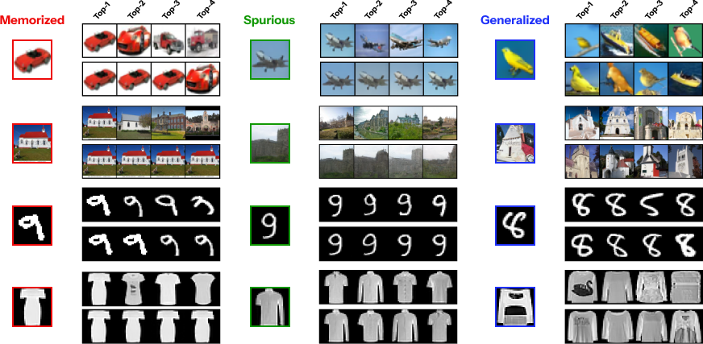
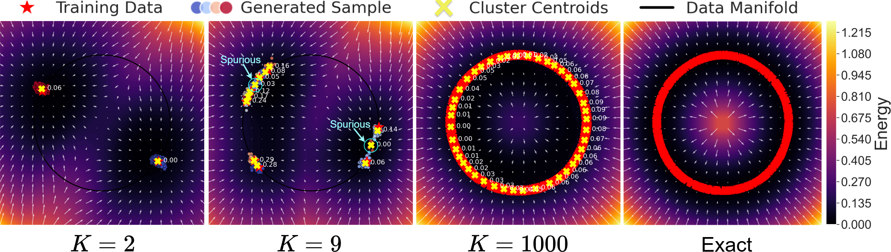

# Memorization to Generalization: <br>Emergence of Diffusion Models from Associative Memory [[Paper]](https://arxiv.org/abs/2505.21777)</br>



# Table of content
 - [Setting up](#item-one-general)
    - [Training Models](#training)
    - [Storing Files](#storing)
    - [Synthetic Data](#synthetic)
 - [Analysis](#item-two-general)
    - [Computing Distance](#distance-computation)
    - [Classify Memorized, Spurious, and Generalized](#classify)
    - [Critical Time](#critical)
    - [Toy Model](#toy)
 - [Citation](#cite)

## Prerequisite
```bash
pip install -r requirements.txt
```

<!-- headings -->
<a id="training"></a>
## Training Models
---
Please use **train_unet.py** to train the DDPM-based diffusion model as the following:
```bash
python train_unet.py \
    --config_path=./configs/cifar10.yaml \
    --centercrop False \
    --train-size 16000 \
    --results-path cifar10-unet128/16k \
    --dim 128 \
    --log-every 500 \
    --ckpt-every 2500 \
    --iterations 500000 \
    --num-workers 8
```
Note, you can override the parameters set in the **.yaml** file since [simple-parsing](https://github.com/lebrice/SimpleParsing) is able to handle such a task. Moreover, see the following [google drive link](https://drive.google.com/drive/folders/1bWiHdwc0nWd4gk5Ed-Vn2zaX5XUP2BtH?usp=share_link) for pre-trained models and their corresponding synthetic sets of various datasets.

---
When the training begins, a result folder will be created and the following three folders are created as well:
```bash
results
  /checkpoints    # hold model checkpoints (.pt)
  /samples        # generations done via DDIM 
  /logs           # (.txt) of logger files
```
Finally, please use the **--help** flag to display the available options. 
```bash
python train_unet.py --help
```
If you find issues with the logging, you'll have to swap out the logger with print statements, unfortunately.

<!-- headings -->
<a id="storing"></a>
## Storing Files
Assuming that you will have many folders, denoting different models, you can store your fully trained models into a single folder:
```bash
fully_trained_checkpoints/
    /2.pt
    /500.pt 
    ...
    /50000.pt
```
where each prefix number denotes the model trained with a specific $K$ training size. You do not need to sort these files by hand. 

The codes will take care of this issue. Nonetheless, all files need to be stored in the following format: 

**$K$.ext** where **.ext** can be either be **.pt** (model checkpoints) or **.npz** (synthetic sets and subsequent evaluation files). 

<!-- headings -->
<a id="synthetic"></a>
## Synthetic Generation
Please use the following **run_generate.py** script to generate synthetic data given a model trained with $K$ training size.
```bash
python run_generate.py \
    --result-path generations/1000/ \
    --ckpt-path models/1000.pt \
    --batch-size 512 \
    --num-files 100
```
This will generate 100 **.npz** files where each holds 512 images. You will simply need to load all of these files, concatenate the numpy arrays, and **save that concatenation into a single .npz file**.

---
# Evaluation
Below, we provide details on the scripts which you can run to reproduce the experimental results.




<!-- headings -->
<a id="distance-computation"></a>
## Computing Distances 
To compute the distances, use the following script **run_distances.py** and also use the **--help** for more details.
```bash
python run_distances.py \
    --result-path dists \
    --synth-path synthetics/ \
    --data-path data/ \
    --use-lpips \
    --k 5 \         
    --network alex \ 
    --start-idx 0 \
    --final-idx -1
```
Since this process takes a very long time, you can submit multiple jobs to perform the distance computation (in parallel) across different $K$ training sizes, by using the flags **--start-idx** and **--final-idx** to specifiy the splits. 

<!-- headings -->
<a id="classify"></a>
## Classify Memorized, Spurious, and Generalized 
To classify the memorized, spurious, and generalized samples, use the following script **run_classify.py**.
```bash
python run_classify.py \ 
    --result-path identified/ \
    --dist-path dists/ \
    --eval-path synthetics/ \
    --data-path data/ \
    --k 5 \              # top-k neighbors to stored for visualization
    --delta-s 0.02       # delta-spurious
    --delta-m 0.03       # delta-memorized
```
The **identified** folder will have the three following folders, where each hold samples belonging to different $K$ training sizes respectively.
```
identified/
    /memorized
        /*.npz
    /spurious
        /*.npz
    /generalized
        /*.npz
```

<!-- headings -->
<a id="critical"></a>
## Critical Time Computation
To perform the critical time computation, please use the **run_critical_times.py** script.
```bash
python run_critical_times.py \ 
    --result-path identifed/memorized/ \ 
    --ckpt-path model_ckpts/ \ 
    --data-path data/ \ 
    --sample-size 2048/ \ 
    --batch-size 256 \ 
    --use-lpips \
    --network vgg \
    ...
```
The example above specifies the computation of critical times for memorized samples. 
## Relative Energy Computation
Similarly, please use the **run_energy.py** to compute the relative energy. 
```bash 
python run_energy.py \
    --ref-path reference/image.npz \ 
    --ckpt-path model_ckpts/ \
    --data-path data/ \ 
    --sample-path identified/memorized \ 
    --sample-size 2048 \ 
    --batch-size 512 
```

<!-- headings -->
<a id="toy"></a>
## Toy Model
Please use the **toy_example.py** script.
```
python toy_example.py --help
```


<!-- headings -->
<a id="cite"></a>
## Citation
If you find this work useful, please kindly cite us.
```
@inproceedings{Pham2025MemorizationTG,
  title={Memorization to Generalization: Emergence of Diffusion Models from Associative Memory},
  author={Bao Pham and Gabriel Raya and Matteo Negri and Mohammed J. Zaki and Luca Ambrogioni and Dmitry Krotov},
  year={2025},
  url={https://arxiv.org/abs/2505.21777}
}
```
