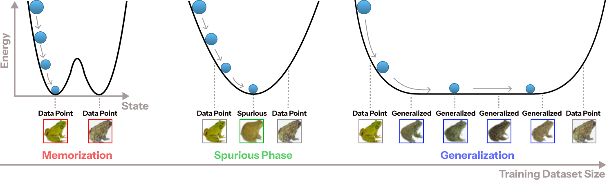
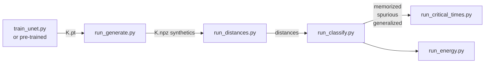
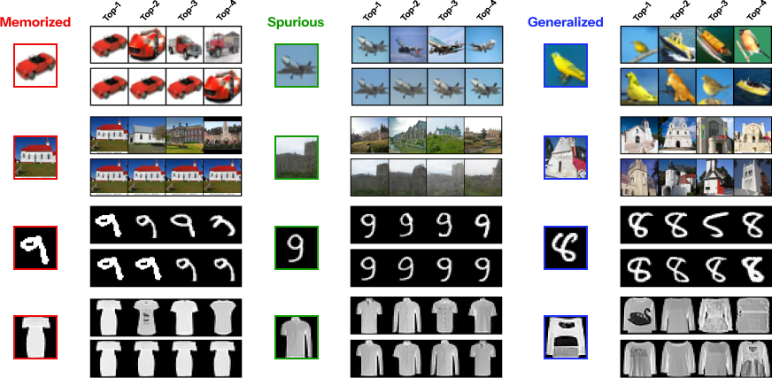
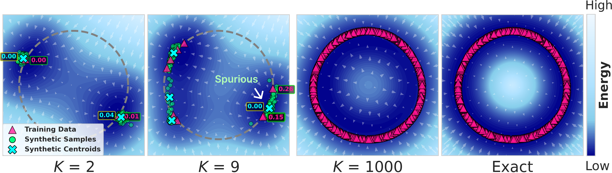

<div align="center">

# Memorization to Generalization<br>Emergence of Diffusion Models from Associative Memory

[](https://arxiv.org/abs/2505.21777)
[](https://huggingface.co/lemoncmd)
[](./LICENSE)

Bao Pham · Gabriel Raya · Matteo Negri · Mohammed J. Zaki · Luca Ambrogioni · Dmitry Krotov

</div>



## Overview

Dense Associative Memories store training data as local minima of an energy landscape.
Push past their critical storage capacity and new minima appear that are *not* training
data — classically dismissed as **spurious states**.

This work reads diffusion models through that lens, treating generation as memory
retrieval. Sweeping the training set size $K$ moves a diffusion model through three
regimes:

| Regime | Training set size | What the attractors are |
|---|---|---|
| **Memorization** | small $K$ | One attractor per training sample |
| **Spurious** | intermediate $K$ | Emergent states that are *not* training data |
| **Generalization** | large $K$ | Novel, coherent samples |

The spurious regime is the interesting one. In associative memory these states are a
failure mode; in generative modeling they are the **first sign of generative ability**.
This repository reproduces that analysis — characterizing the basins of attraction,
energy landscape curvature, and computational properties of those states.

## Contents

- [Installation](#installation)
- [Quick start](#quick-start)
- [Pre-trained models](#pre-trained-models)
- [The $K$ convention](#the-k-convention)
- [Pipeline](#pipeline)
  - [Training](#training)
  - [Synthetic generation](#synthetic-generation)
  - [Computing distances](#computing-distances)
  - [Classifying memorized, spurious, and generalized](#classifying-memorized-spurious-and-generalized)
  - [Critical time](#critical-time)
  - [Relative energy](#relative-energy)
- [Toy model](#toy-model)
- [Repository layout](#repository-layout)
- [Citation](#citation)

## Installation

```bash
git clone https://github.com/Lemon-cmd/Diffusion-Models-and-Associative-Memory.git
cd Diffusion-Models-and-Associative-Memory
pip install -r requirements.txt
```

Requires a CUDA-capable GPU. The pinned `torch==2.0.1+cu118` and
`torchvision==0.15.2+cu118` come from the PyTorch CUDA 11.8 index — if your driver
needs a different build, install torch first and then the rest of the requirements.

Every script accepts `--help`, and each takes a `--config_path` pointing at a `.yaml`
in [`configs/`](./configs). Individual fields can be overridden on the command line,
courtesy of [simple-parsing](https://github.com/lebrice/SimpleParsing).

## Quick start

The fastest path to a result is to skip training and pull a released model.

```bash
# which training sizes are available for CIFAR-10 at width 128
python src/hf_checkpoints.py --data-name cifar10 --dim 128 --list

# grab every model for that sweep
python src/hf_checkpoints.py --data-name cifar10 --dim 128 --result-path model_ckpts/

# generate 100 files of 512 images each from the K=16000 model
python run_generate.py \
    --result-path generations/16000/ \
    --ckpt-path model_ckpts/16000.pt \
    --batch-size 512 \
    --num-files 100
```

## Pre-trained models

Every model used in the paper is on the [Hugging Face Hub](https://huggingface.co/lemoncmd),
as one repository per dataset and UNet width.

| Dataset | `--dim` | Models | Size | Repository |
|---|---|---|---|---|
| CIFAR-10 | 64 | 38 | 5.1 GB | [dm-am-cifar10-unet64](https://huggingface.co/lemoncmd/dm-am-cifar10-unet64) |
| CIFAR-10 | 96 | 38 | 11.4 GB | [dm-am-cifar10-unet96](https://huggingface.co/lemoncmd/dm-am-cifar10-unet96) |
| CIFAR-10 | 128 | 38 | 20.3 GB | [dm-am-cifar10-unet128](https://huggingface.co/lemoncmd/dm-am-cifar10-unet128) |
| LSUN Church | 64 | 38 | 15.6 GB | [dm-am-church64-unet64](https://huggingface.co/lemoncmd/dm-am-church64-unet64) |
| LSUN Church | 96 | 38 | 35.0 GB | [dm-am-church64-unet96](https://huggingface.co/lemoncmd/dm-am-church64-unet96) |
| LSUN Church | 128 | 38 | 62.2 GB | [dm-am-church64-unet128](https://huggingface.co/lemoncmd/dm-am-church64-unet128) |
| Fashion-MNIST | 128 | 38 | 13.9 GB | [dm-am-fmnist-unet128](https://huggingface.co/lemoncmd/dm-am-fmnist-unet128) |
| MNIST | 128 | 38 | 13.9 GB | [dm-am-mnist-unet128](https://huggingface.co/lemoncmd/dm-am-mnist-unet128) |

Fetch them with [`src/hf_checkpoints.py`](./src/hf_checkpoints.py):

```bash
python src/hf_checkpoints.py --data-name cifar10 --dim 128 --list          # available K
python src/hf_checkpoints.py --data-name cifar10 --dim 128 --k 16000       # one model
python src/hf_checkpoints.py --data-name cifar10 --dim 128 --result-path model_ckpts/
```

Or from python:

```python
from src.hf_checkpoints import load_checkpoint, get_train_sizes

get_train_sizes("cifar10", 128)               # [2, 500, 1000, ..., 50000]
ema = load_checkpoint("cifar10", 128, 16000)  # EMA weights, as sampled from in the paper
```

Each `.pt` holds `model` (state dict from a `DistributedDataParallel` wrapper, so keys
carry a `module.` prefix), `ema`, `opt`, `args`, and `iterations`. Optimizer state is
included, so these resume training as well as run inference.

The corresponding **synthetic sets** are not on the Hub; they remain on this
[google drive link](https://drive.google.com/drive/folders/1bWiHdwc0nWd4gk5Ed-Vn2zaX5XUP2BtH?usp=share_link).

## The $K$ convention

Everything in this repository is keyed on $K$, the **size of the training set** — not a
training step. Every model trains for the same number of iterations; $K$ is the axis
that moves it between regimes.

Files are named `K.ext`, where `.ext` is `.pt` for model checkpoints and `.npz` for
synthetic sets and evaluation output:

```
model_ckpts/
    2.pt          # trained on 2 samples      -> memorization
    500.pt
    1000.pt
    ...
    50000.pt      # trained on the full set   -> generalization
```

Every script sorts these numerically on its own, so the ordering on disk does not
matter. Keeping one $K$ per file is what lets `--start-idx` and `--final-idx` split a
sweep across parallel jobs.

## Pipeline


```mermaid
flowchart LR
    A[train_unet.py<br/>or pre-trained] -->|K.pt| B[run_generate.py]
    B -->|K.npz synthetics| C[run_distances.py]
    C -->|distances| D[run_classify.py]
    D -->|memorized<br/>spurious<br/>generalized| E[run_critical_times.py]
    D --> F[run_energy.py]
```

Each stage writes `K`-keyed files that the next stage consumes. Stages marked with
`--start-idx` / `--final-idx` can be split across jobs and run in parallel.

### Training

```bash
python train_unet.py \
    --config_path=./configs/cifar10.yaml \
    --centercrop False \
    --train-size 16000 \
    --results-path cifar10-unet128/16k \
    --dim 128 \
    --log-every 500 \
    --ckpt-every 2500 \
    --iterations 500000 \
    --num-workers 8
```

Options come from three dataclasses in [`parse_utils.py`](./parse_utils.py) — a
selection:

| Flag | Default | Meaning |
|---|---|---|
| `--data-name` | `cifar10` | One of `mnist`, `cifar10`, `lsun-church`, `fashionmnist` |
| `--train-size` | `1000` | $K$ — the quantity this whole study sweeps |
| `--dim` | `128` | UNet base width |
| `--dim-mults` | `1,2,2,2` | Width multipliers per resolution |
| `--iterations` | `400000` | Training steps |
| `--ckpt-every` | `500` | Checkpoint interval |
| `--ema-decay` | `0.9999` | EMA decay; EMA weights are what the paper samples from |
| `--timesteps` | `1000` | Diffusion steps |
| `--global-batch-size` | `128` | Batch size across all ranks |

Training creates a result folder containing:

```
results/
  checkpoints/    # model checkpoints (.pt)
  samples/        # generations via DDIM
  logs/           # logger output (.txt)
```

> If logging misbehaves in your environment, swap the logger for print statements.

### Synthetic generation

```bash
python run_generate.py \
    --result-path generations/1000/ \
    --ckpt-path model_ckpts/1000.pt \
    --batch-size 512 \
    --num-files 100
```

| Flag | Default | Meaning |
|---|---|---|
| `--result-path` | — | Where the `.npz` files land |
| `--ckpt-path` | — | A single `K.pt` |
| `--batch-size` | `512` | Images per file |
| `--num-files` | `10000` | Number of `.npz` files |
| `--seed` | `3407` | Random seed |

This writes `--num-files` files of `--batch-size` images each. **Concatenate them into a
single `K.npz`** before moving on — the analysis scripts expect one file per $K$. The
script is adapted from [DiT](https://github.com/facebookresearch/DiT) and runs across
multiple GPUs and nodes.

### Computing distances

```bash
python run_distances.py \
    --result-path dists \
    --synth-path synthetics/ \
    --data-path data/ \
    --use-lpips \
    --k 5 \
    --network alex \
    --start-idx 0 \
    --final-idx -1
```

| Flag | Default | Meaning |
|---|---|---|
| `--result-path` | — | Output folder |
| `--synth-path` | — | Folder of `K.npz` synthetic sets |
| `--data-path` | — | Training data |
| `--use-lpips` | off | Use LPIPS instead of the default metric |
| `--network` | `alex` | LPIPS backbone (`alex`, `vgg`) |
| `--k` | `5` | Nearest neighbors to keep |
| `--eval-batch-size` | `256` | Batch size over the synthetic set |
| `--ref-batch-size` | — | Batch size over the reference set |
| `--start-idx` / `--final-idx` | `0` / `-1` | Slice of the $K$ sweep to process |
| `--overwrite` | off | Recompute existing results |

This is the slow stage. Split it across jobs with `--start-idx` and `--final-idx`,
each handling a slice of the $K$ sweep.

### Classifying memorized, spurious, and generalized

```bash
python run_classify.py \
    --result-path identified/ \
    --dist-path dists/ \
    --eval-path evals/ \
    --synth-path synthetics/ \
    --data-path data/ \
    --k 5 \
    --delta-s 0.02 \
    --delta-m 0.03
```

| Flag | Default | Meaning |
|---|---|---|
| `--result-path` | — | Output folder |
| `--dist-path` | — | Output of `run_distances.py` |
| `--eval-path` | — | Evaluation files |
| `--synth-path` | — | Folder of `K.npz` synthetic sets |
| `--delta-m` | `0.33` | Memorization threshold |
| `--delta-s` | `0.33` | Spurious threshold |
| `--top-size` | `256` | Top samples retained per class |
| `--least-size` | `64` | Bottom samples retained per class |
| `--k` | `5` | Neighbors kept for visualization |

The thresholds decide the split, so they are the knobs worth tuning first — the
defaults above are not the values used in the example.

```
identified/
    memorized/*.npz
    spurious/*.npz
    generalized/*.npz
```



### Critical time

The point in the reverse trajectory where a sample commits to a basin.

```bash
python run_critical_times.py \
    --result-path critical/ \
    --sample-path identified/memorized/ \
    --ckpt-path model_ckpts/ \
    --data-path data/ \
    --sample-size 2048 \
    --batch-size 256 \
    --use-lpips \
    --network vgg
```

| Flag | Default | Meaning |
|---|---|---|
| `--sample-path` | — | One class from `identified/` |
| `--ckpt-path` | — | Folder of `K.pt` files |
| `--sample-size` | `64` | Samples to evaluate |
| `--p-trials` | `10` | Noise trials per sample |
| `--p` | `0.9` | Recovery probability threshold |
| `--delta` | `0.1` | Recovery distance tolerance |
| `--stride` | `25` | Stride over diffusion time |
| `--ddim-steps` | `20` | DDIM steps per reversal |
| `--eta` | `0.0` | DDIM stochasticity, `0` is deterministic |
| `--use-least` | off | Use the bottom rather than top samples |

Point `--sample-path` at `memorized/`, `spurious/`, or `generalized/` to get the
critical times for that class.

### Relative energy

```bash
python run_energy.py \
    --result-path energy/ \
    --ref-path reference/image.npz \
    --sample-path identified/memorized/ \
    --ckpt-path model_ckpts/ \
    --data-path data/ \
    --sample-size 2048 \
    --batch-size 384
```

| Flag | Default | Meaning |
|---|---|---|
| `--ref-path` | — | Reference `.npz` the energy is measured against |
| `--sample-path` | — | One class from `identified/` |
| `--ckpt-path` | — | Folder of `K.pt` files |
| `--sample-size` | `2048` | Samples to evaluate |
| `--batch-size` | `384` | Batch size |
| `--use-least` | off | Use the bottom rather than top samples |

## Toy model

A 2D example on a circle, where the energy landscape can be drawn directly.
[`toy_example.py`](./toy_example.py) is a `click` group with five subcommands:

```bash
python toy_example.py data  --seed 9                        # visualize the data splits
python toy_example.py exact --sample_size 2 --beta 20.0     # exact energy and scores
python toy_example.py train --sample_size 2 --n_iter 500000 --sampling_freq 50000
python toy_example.py plots --sample_size 9 --t 0.15 --checkpoint 800000 \
                            --distance_threshold 2.0 --batch_size 10000
python toy_example.py basin --sample_size 2 --checkpoint 500000 --delta 0.01
```

`plots` clusters the recovered attractors — pass `--dynamic_threshold True` for DBSCAN
instead of a fixed `--distance_threshold`. `basin` computes the optimal recovery time.
Run `python toy_example.py --help` for the full set of documented examples.



## Repository layout

```
configs/                 # per-dataset YAML defaults
figures/                 # figures used in this README
src/
    models/              # DDPM UNet definition, layers, helpers
    misc.py              # file naming and sorting utilities
    hf_checkpoints.py    # download released models from the Hub
parse_utils.py           # DataOptions / TrainOptions / ModelOptions dataclasses
train_utils.py           # datasets, transforms, sampling, distributed setup
stats_utils.py           # metrics, nearest neighbors, file sorting
lpips.py                 # LPIPS distance
train_unet.py            # train a diffusion model at a given K
run_generate.py          # sample synthetic sets from a checkpoint
run_distances.py         # distances from synthetics to training data
run_classify.py          # split into memorized / spurious / generalized
run_critical_times.py    # critical time per class
run_energy.py            # relative energy per class
toy_example.py           # 2D circle toy model
```

## Citation

```bibtex
@inproceedings{Pham2025MemorizationTG,
  title   = {Memorization to Generalization: Emergence of Diffusion Models from Associative Memory},
  author  = {Bao Pham and Gabriel Raya and Matteo Negri and Mohammed J. Zaki and Luca Ambrogioni and Dmitry Krotov},
  year    = {2025},
  url     = {https://arxiv.org/abs/2505.21777}
}
```

## License

[MIT](./LICENSE)
